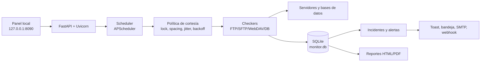

<!-- StabilityMonitor monitorea conexiones FTP/SFTP/WebDAV y bases de datos desde Windows, offline, con historial, alertas y reportes de estabilidad. -->
<div align="center">
  

  <h1>StabilityMonitor</h1>
  <p><strong>Monitor offline para saber si tus conexiones FTP, SFTP, WebDAV y bases de datos están disponibles, sin sobrecargar los sistemas que vigila.</strong></p>

  
  
  
  
  
</div>

---

## 📋 Tabla de Contenidos

- [¿Qué es este proyecto?](#que-es-este-proyecto)
- [Demo en vivo](#demo-en-vivo)
- [Características principales](#caracteristicas-principales)
- [Capturas de pantalla](#capturas-de-pantalla)
- [Instalación rápida](#instalacion-rapida)
- [Cómo usar](#como-usar)
- [Arquitectura](#arquitectura)
- [Roadmap](#roadmap)
- [Contribuir](#contribuir)
- [Licencia](#licencia)

---

<a id="que-es-este-proyecto"></a>

## 🎯 ¿Qué es este proyecto?

StabilityMonitor es una aplicación de monitoreo para conexiones corporativas críticas: servidores FTP, FTPS, SFTP, WebDAV, WebDAVS y bases de datos PostgreSQL, MySQL, MariaDB, SQL Server y Oracle. Ayuda a saber qué conexión está activa, cuál falló, desde cuándo, por qué falló y cómo se comportó durante el tiempo.

Está diseñado para operar 24/7 en Windows 10 Pro x64, incluso en entornos sin internet, con un ejecutable portable, historial local, alertas, reportes HTML/PDF y una política de chequeo cuidadosa para que el monitor nunca se convierta en carga para los sistemas monitoreados.

### El problema que resuelve

Muchas integraciones dependen de rutas FTP, SFTP, WebDAV o bases de datos que pueden fallar en silencio. Cuando el error se descubre horas después, el equipo ya perdió tiempo, trazabilidad y capacidad de explicar qué ocurrió.

### La solución

StabilityMonitor centraliza esas conexiones en un panel local, las prueba de forma periódica, clasifica la causa de los fallos, conserva historial e incidentes, y genera reportes de estabilidad listos para compartir con clientes o áreas internas.

### ¿Para quién es?

| Audiencia | Beneficio clave |
|-----------|----------------|
| Equipos de infraestructura | Detectan caídas de conexiones críticas sin montar una plataforma pesada. |
| Operaciones y soporte | Ven estado, causa, historial y tiempo de indisponibilidad desde un solo panel. |
| DBAs y administradores de archivos | Monitorean disponibilidad y objetivos concretos con chequeos de bajo impacto. |
| Proveedores de servicio | Entregan reportes por cliente con evidencia de disponibilidad e incidentes. |

---

<a id="demo-en-vivo"></a>

## 🎬 Demo en vivo

El proyecto incluye un modo demo para evaluar el panel sin conectarse a servidores reales. Siembra conexiones ficticias, historial, incidentes y métricas de ejemplo.

```bash
python -m app.main --demo
```

Después abre `http://127.0.0.1:8090`.

<div align="center">
  
  <p><em>Flujo principal: revisar estado general, abrir el detalle de una conexión y analizar latencia, disponibilidad e incidentes.</em></p>
</div>

---

<a id="caracteristicas-principales"></a>

## ✨ Características principales

| Feature | Descripción |
|---------|-------------|
| 🛡️ **Monitoreo de bajo impacto** | Serializa chequeos por host, aplica espaciado, jitter y backoff para evitar duplicar sesiones o aumentar la carga durante una caída. |
| 🔌 **Soporte multiprotocolo** | Monitorea FTP, FTPS, SFTP, WebDAV, WebDAVS, PostgreSQL, MySQL, MariaDB, SQL Server y Oracle desde una sola interfaz. |
| 🎯 **Objetivos verificables** | Comprueba rutas, carpetas, esquemas o tablas específicas para distinguir entre “el servidor responde” y “el recurso esperado existe”. |
| 🚨 **Incidentes y alertas con causa** | Clasifica fallos como DNS, timeout, autenticación, TLS, ruta inexistente u otros, y registra apertura/cierre de incidentes. |
| 📊 **Reportes HTML y PDF** | Genera reportes autocontenidos por cliente con uptime, downtime, MTTR, incidentes y metodología de cálculo. |
| 🔄 **Exportación e importación** | Permite respaldar configuraciones en JSON, importar conexiones y conservar alias virtuales sin crear sesiones adicionales. |

---

<a id="capturas-de-pantalla"></a>

## 📸 Capturas de pantalla

### Panel principal
<div align="center">
  
  <p><em>Vista de operación diaria: cada conexión muestra estado, disponibilidad reciente, último chequeo y cliente asociado.</em></p>
</div>

### Detalle de conexión
<div align="center">
  
  <p><em>El detalle permite investigar una conexión sin perder contexto: latencia, línea de tiempo, incidentes y registros recientes.</em></p>
</div>

### Reporte de estabilidad
<div align="center">
  
  <p><em>Reporte listo para compartir: resume disponibilidad, incidentes, downtime y comportamiento histórico por cliente.</em></p>
</div>

---

<a id="instalacion-rapida"></a>

## 🚀 Instalación rápida

### Prerrequisitos

Para usar el paquete publicado:

- Windows 10 Pro x64.
- PowerShell.
- No requiere internet en la máquina destino.
- No requiere Python instalado.

Para construir desde código:

- Windows x64.
- Python 3.12, o el instalador incluido en `vendor/`.

### Pasos

```bash
# 1. Clonar el repositorio
git clone https://github.com/castellanosfelipe/StabilityMonitor.git
cd StabilityMonitor
```

#### Opción recomendada: usar el ejecutable V2

1. Descarga el ejecutable V2 desde [StabilityMonitor-v2.0.0-win64.zip](https://github.com/castellanosfelipe/StabilityMonitor/releases/download/v2.0.0/StabilityMonitor-v2.0.0-win64.zip).
2. Copia el ZIP a la máquina Windows sin internet.
3. Descomprime la carpeta completa.
4. Ejecuta dentro de la carpeta:

```powershell
powershell -ExecutionPolicy Bypass -File .\install.ps1
```

✅ Si todo está correcto, verás que se registra la tarea programada `StabilityMonitor`, se inicia la aplicación y el dashboard queda disponible en `http://127.0.0.1:8090`.

#### Construir desde el repositorio

```powershell
# Instalar Python 3.12 si hace falta
vendor\python-3.12.10-amd64.exe

# Construir el ejecutable usando dependencias locales de wheelhouse/
powershell -ExecutionPolicy Bypass -File .\build.ps1

# Instalar el resultado
cd dist\StabilityMonitor
powershell -ExecutionPolicy Bypass -File .\install.ps1
```

---

<a id="como-usar"></a>

## 💡 Cómo usar

### Caso de uso básico

Ejecuta el monitor y abre el panel local:

```bash
python -m app.main
```

Luego entra a:

```text
http://127.0.0.1:8090
```

Desde el dashboard selecciona **Nueva conexión**, define protocolo, host, puerto o instancia, usuario, secreto, objetivos e intervalo. Antes de guardar puedes usar **Probar conexión** para validar el chequeo completo.

### Casos de uso avanzados

#### Importar conexiones desde JSON

```json
{
  "app": "StabilityMonitor",
  "version": "2.0.0",
  "settings": {},
  "connections": [
    {
      "name": "SFTP Producción",
      "client": "Cliente A",
      "protocol": "SFTP",
      "host": "10.0.0.10",
      "port": 22,
      "username": "monitor",
      "secret": "contraseña-local",
      "auth_type": "password",
      "targets_json": "[\"/entrada\"]",
      "aliases_json": "[]",
      "interval_s": 60,
      "timeout_s": 10,
      "retries": 2
    }
  ]
}
```

Las contraseñas incluidas en un archivo de importación se cifran localmente al restaurar. Las exportaciones normales no incluyen secretos.

#### Configurar SQL Server con instancia

Cuando no tengas puerto fijo, usa la instancia:

```text
Host: 192.0.2.11
Puerto: dejar vacío
Instancia SQL Server: SQLEXPRESS_TEST
Base de datos: opcional
```

El monitor conectará usando `192.0.2.11\SQLEXPRESS_TEST`. Si defines un puerto explícito, el puerto tiene prioridad.

#### Verificar objetivos concretos

```text
/demo/entrada
/demo/resoluciones_años
ventas.pedidos
```

Las rutas aplican a servidores de archivos y las tablas/esquemas a bases de datos. Un objetivo inexistente marca la conexión como `DEGRADED`, no como caída total.

#### Generar reportes

Desde el panel abre **Reportes**, elige cliente y rango de fechas, y genera el resultado. El archivo queda en `reports/` como HTML autocontenido y PDF descargable.

---

<a id="arquitectura"></a>

## 🏗️ Arquitectura

StabilityMonitor corre como un solo proceso local: sirve el panel web, agenda chequeos, registra resultados, maneja incidentes y genera reportes. Todo el estado vive junto al ejecutable para facilitar instalación, respaldo y operación offline.



### Stack tecnológico

| Capa | Tecnología | Propósito |
|------|-----------|-----------|
| Panel y API | FastAPI + Uvicorn | Dashboard local y endpoints de operación. |
| Frontend | HTML, CSS, JavaScript y Chart.js local | Interfaz sin CDN ni build frontend. |
| Planificación | APScheduler | Agenda chequeos sin solapar una conexión consigo misma. |
| Protocolos de archivos | `ftplib`, Paramiko, HTTPX | FTP/FTPS, SFTP y WebDAV(S). |
| Bases de datos | pg8000, PyMySQL, python-tds, python-oracledb | Chequeos de PostgreSQL, MySQL/MariaDB, SQL Server y Oracle. |
| Persistencia | SQLite en modo WAL | Conexiones, historial, incidentes, ajustes y alertas. |
| Secretos | DPAPI en Windows; Fernet en desarrollo | Cifrado local de credenciales. |
| Empaquetado | PyInstaller | Ejecutable portable para Windows x64. |

---

<a id="roadmap"></a>

## 🗺️ Roadmap

### ✅ Completado

- [x] Dashboard local con estado en vivo, filtros y detalle por conexión.
- [x] Monitoreo de FTP, FTPS, SFTP, WebDAV y WebDAVS.
- [x] Monitoreo de PostgreSQL, MySQL, MariaDB, SQL Server y Oracle.
- [x] Campo de instancia para SQL Server cuando no hay puerto fijo.
- [x] Política de bajo impacto: una sesión por host, espaciado, rate limit, jitter y backoff.
- [x] Historial, incidentes, alertas, logs rotativos y retención configurable.
- [x] Reportes HTML y PDF por cliente.
- [x] Exportación/importación JSON de configuraciones.
- [x] Alias virtuales sin duplicar sesiones ni alterar parámetros técnicos.
- [x] Empaquetado offline para Windows x64 y release V2.

### 🔄 En progreso

- [ ] Validación operativa prolongada en Windows 10 Pro x64 con monitoreo 24/7.
- [ ] Ajustes finos de diagnóstico para ambientes con rutas legacy y codificaciones mixtas.

### 🔮 Próximamente

- [ ] Firma digital del ejecutable.
- [ ] Plantillas adicionales de reportes para distintos perfiles de cliente.
- [ ] Nuevos canales de alerta corporativos según necesidad de operación.

---

<a id="contribuir"></a>

## 🤝 Contribuir

Las contribuciones son bienvenidas. Para cambios funcionales, abre primero un issue o una conversación de diseño para alinear alcance, impacto en monitoreo y cobertura de pruebas.

```bash
git clone https://github.com/castellanosfelipe/StabilityMonitor.git
cd StabilityMonitor
python -m venv .venv
.venv/bin/pip install -r requirements.txt -r requirements-dev.txt
.venv/bin/python -m pytest
```

En Windows PowerShell:

```powershell
python -m venv .venv
.\.venv\Scripts\pip.exe install -r requirements.txt -r requirements-dev.txt
.\.venv\Scripts\python.exe -m pytest
```

Antes de proponer cambios grandes, revisa [`docs/DECISIONS.md`](docs/DECISIONS.md) y [`docs/USER_GUIDE.md`](docs/USER_GUIDE.md).

---

<a id="licencia"></a>

## 📄 Licencia

Este proyecto está disponible bajo la licencia MIT. Consulta el archivo [`LICENSE`](LICENSE) para ver los términos completos.

---

<div align="center">
  <p>Hecho con ❤️ por <a href="https://github.com/castellanosfelipe">castellanosfelipe</a></p>
</div>
