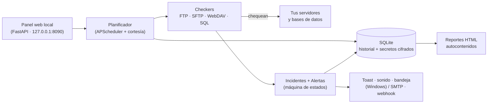

<!-- TODO: agregar un banner/logo (ej. assets/banner.png, ancho 800px) y descomentar el bloque siguiente.
     Sugerencia: una captura del dashboard en modo oscuro con la grilla de conexiones en verde/ámbar/rojo. -->
<!--
<div align="center">
  
</div>
-->

<div align="center">

# StabilityMonitor

**Vigila tus servidores FTP/SFTP/WebDAV y tus bases de datos desde un solo panel — sin sobrecargarlos nunca, y funcionando 100 % offline en Windows.**

[](https://github.com/castellanosfelipe/Monitor-DB-FTP-SFTP-WebDav/releases)
[](https://github.com/castellanosfelipe/Monitor-DB-FTP-SFTP-WebDav/actions/workflows/build-windows.yml)


</div>

---

## 📋 Tabla de Contenidos

- [¿Qué es StabilityMonitor?](#-qué-es-stabilitymonitor)
- [Demo en vivo](#-demo-en-vivo)
- [Características principales](#-características-principales)
- [Capturas de pantalla](#-capturas-de-pantalla)
- [Instalación rápida](#-instalación-rápida)
- [Cómo usar](#-cómo-usar)
- [Arquitectura](#️-arquitectura)
- [Roadmap](#️-roadmap)
- [Contribuir](#-contribuir)
- [Licencia](#-licencia)

---

## 🎯 ¿Qué es StabilityMonitor?

StabilityMonitor es una herramienta de **monitoreo de disponibilidad** para servidores de archivos (FTP, FTPS, SFTP, WebDAV, WebDAVS) y bases de datos (PostgreSQL, MySQL, MariaDB, SQL Server, Oracle). Te dice, en todo momento, **qué conexiones están vivas, cuáles fallaron, cuándo y por qué** — y genera reportes de estabilidad listos para enviar a tus clientes.

Está pensada para el mundo real de la infraestructura corporativa: **corre como un ejecutable portable en una máquina Windows sin acceso a internet**, y su principio de diseño número uno es que *el propio monitor jamás debe convertirse en el problema*.

### El problema que resuelve

Un proceso desatendido —un ETL nocturno, una integración de archivos, un job de respaldo— depende de conexiones que pueden caer en silencio. Cuando el servidor SFTP del proveedor reinicia a las 2 a. m., nadie se entera hasta que a las 9 a. m. falta el reporte. **El daño ya ocurrió, y la causa fue una sola conexión que nadie estaba vigilando.**

### La solución

StabilityMonitor sondea tus conexiones de forma continua y **con cortesía** (nunca dos sesiones simultáneas contra el mismo host, con espaciado y backoff automático), confirma las caídas con histéresis para evitar falsos positivos, y te alerta al instante — con la causa clasificada (DNS, timeout, TLS, autenticación, ruta/tabla inexistente…), no solo un genérico "está caído".

### ¿Para quién es?

| Audiencia | Beneficio clave |
|-----------|-----------------|
| **Sysadmins e ingenieros de sistemas** | Visibilidad centralizada de decenas de conexiones legacy sin montar infraestructura pesada ni tocar internet. |
| **Equipos DevOps / SRE** | Detección temprana de fallos (en minutos, no horas) con causa clasificada e historial completo de uptime y latencia. |
| **DBAs** | Saber que PostgreSQL, SQL Server u Oracle siguen respondiendo —y que la tabla crítica sigue ahí— con chequeos de solo lectura que nunca escriben. |
| **MSPs y proveedores de servicios** | Reportes de estabilidad por cliente (un solo HTML) para demostrar el uptime de los sistemas que administran. |

---

## 🎬 Demo en vivo

La forma más rápida de ver el producto funcionando —con datos realistas, sin configurar un solo servidor— es el **modo demo**, que siembra 6 conexiones ficticias de dos clientes con 30 días de historial sintético, incidentes y gráficas:

```bash
python -m app.main --demo
# Abre http://127.0.0.1:8090 en tu navegador
```

<!-- TODO: grabar un GIF corto (≤ 700px de ancho) del flujo principal y colocarlo en assets/demo.gif.
     Sugerencia de guion (30-45 s): abrir el dashboard con la grilla de conexiones →
     una conexión pasa a rojo con su causa → abrir el detalle con la gráfica de latencia →
     generar un reporte de cliente. Luego descomentar el bloque de abajo. -->
<!--
<div align="center">
  
  <p><em>Del panel a la alerta y al reporte del cliente, en menos de un minuto.</em></p>
</div>
-->

> 💡 ¿Prefieres el ejecutable ya construido? Descárgalo desde la [página de Releases](https://github.com/castellanosfelipe/Monitor-DB-FTP-SFTP-WebDav/releases) y ejecútalo en Windows — sin internet ni Python.

---

## ✨ Características principales

| Feature | Descripción |
|---------|-------------|
| 🛡️ **Cortesía por diseño** | El monitor nunca sobrecarga lo que vigila: una sola sesión por host, espaciado y *jitter* entre chequeos, y *backoff* progresivo cuando un servidor ya está caído. |
| 🔌 **Multiprotocolo** | Diez protocolos con un chequeo definido para cada uno: FTP, FTPS, SFTP (llave o contraseña), WebDAV, WebDAVS y las bases PostgreSQL, MySQL, MariaDB, SQL Server y Oracle. |
| 🎯 **Verificación de objetivos** | No solo "¿responde el puerto?": comprueba que la carpeta del cliente (`/clientes/acme/entrada`) o la tabla crítica (`ventas.pedidos`) siguen ahí. |
| 🚨 **Alertas con causa** | Una sola alerta por incidente (toast nativa + sonido + ícono de bandeja en Windows), con la causa clasificada y la duración exacta al recuperarse. |
| 📊 **Reportes para clientes** | Un único archivo HTML autocontenido por cliente y rango de fechas: uptime, incidentes, downtime, MTTR y comparativa contra el período anterior. Se abre sin internet. |
| 💾 **Offline y portable** | Ejecutable autocontenido para Windows 10 Pro x64: sin instalar Python, sin internet en tiempo de ejecución, sin servidor de licencias. Los secretos se cifran con DPAPI. |

---

## 📸 Capturas de pantalla

<!-- TODO: el proyecto tiene una interfaz web real (templates/index.html + static/), pero aún no hay
     capturas en el repositorio. Ejecuta `python -m app.main --demo`, toma las capturas indicadas abajo
     (ancho ≤ 750px), guárdalas en assets/ y descomenta los bloques correspondientes. -->

<!--
### Panel principal
<div align="center">
  
  <p><em>Una tarjeta por conexión con estado, uptime y latencia; se actualiza sola cada 10 s.</em></p>
</div>

### Detalle de una conexión
<div align="center">
  
  <p><em>Gráfica de latencia y línea de tiempo de disponibilidad (24 h / 7 d / 30 d) con la lista de incidentes.</em></p>
</div>

### Reporte de estabilidad del cliente
<div align="center">
  
  <p><em>Reporte autocontenido listo para enviar: resumen ejecutivo, incidentes y comparativa mensual.</em></p>
</div>
-->

> 📌 **Pendiente de capturas.** La UI existe y funciona (dashboard en `127.0.0.1:8090`); faltan las imágenes en el repo. Corre el modo demo y añádelas a `assets/`.

---

## 🚀 Instalación rápida

### Opción A — Descargar el ejecutable (recomendada)

La máquina destino **no necesita internet ni Python**.

1. Desde cualquier equipo con internet, descarga `StabilityMonitor-vX.Y.Z-win64.zip` de la [página de Releases](https://github.com/castellanosfelipe/Monitor-DB-FTP-SFTP-WebDav/releases).
2. Cópialo por USB a la máquina Windows destino y descomprímelo.
3. Dentro de la carpeta, en PowerShell:

```powershell
powershell -ExecutionPolicy Bypass -File .\install.ps1
```

✅ Registra el autoarranque de usuario (sin permisos de administrador), inicia la app y muestra el ícono en la bandeja. Abre el panel en **http://127.0.0.1:8090**.

### Opción B — Construir desde el código (Windows, también offline)

**Prerrequisitos:** Windows x64 y Python 3.12 (el instalador oficial viene incluido en `vendor/`).

```powershell
# 1. (si no tienes Python 3.12) instalarlo desde el instalador vendorizado
vendor\python-3.12.10-amd64.exe

# 2. construir el ejecutable — instala desde wheelhouse/, sin tocar internet
powershell -ExecutionPolicy Bypass -File .\build.ps1

# 3. instalar el resultado
cd dist\StabilityMonitor
powershell -ExecutionPolicy Bypass -File .\install.ps1
```

### Para desarrollo (cualquier SO con Python 3.12)

```bash
python3.12 -m venv .venv
.venv/bin/pip install -r requirements.txt -r requirements-dev.txt
.venv/bin/python -m pytest        # 127 pruebas unitarias
.venv/bin/python -m app.main      # dashboard en http://127.0.0.1:8090
```

---

## 💡 Cómo usar

### Caso básico — probar un chequeo puntual

Verifica una conexión ad-hoc, sin guardar nada, desde un archivo JSON:

```bash
python -m app.check --file conn.json
```

```json
{
  "protocol": "SFTP",
  "host": "sftp-prod-01.payments.internal",
  "port": 22,
  "username": "monitor",
  "secret": "...",
  "targets": ["/clientes/acme/entrada"],
  "timeout_s": 10
}
```

El resultado indica el estado, la latencia y el resultado por cada objetivo. Códigos de salida: `0` UP · `1` DEGRADED · `2` DOWN · `3` configuración inválida.

### Añadir y monitorear conexiones (desde el panel)

Abre `http://127.0.0.1:8090`, pulsa **Nueva conexión**, elige el protocolo y completa host, usuario, secreto e intervalo. El botón **Probar conexión** ejecuta el chequeo completo antes de guardar. A partir de ahí, la conexión se monitorea sola con la política de cortesía.

### Verificar rutas y tablas concretas

En el campo **Objetivos** de una conexión, uno por línea:

```text
/clientes/acme/entrada      ← ruta en un servidor de archivos
ventas.pedidos              ← tabla en una base de datos
```

Una ruta o tabla inexistente marca la conexión como **DEGRADED** con causa `ruta/objeto inexistente` — distinta de "servidor caído", para que el reporte cuente la historia correcta.

### Generar un reporte de cliente

Desde el panel: **Reportes → elige cliente y rango → Generar**. El resultado es un único archivo HTML en `reports/`, autocontenido, que se abre sin internet y se imprime a PDF.

---

## 🏗️ Arquitectura

Un solo proceso Python sirve el panel web local y orquesta los chequeos; todo el estado vive en un archivo SQLite. El adaptador de plataforma permite que lo específico de Windows (cifrado DPAPI, notificaciones, bandeja) conviva con el desarrollo en otros sistemas.



### Stack tecnológico

| Capa | Tecnología | Propósito |
|------|-----------|-----------|
| Panel + API | FastAPI + Uvicorn | Dashboard local y API REST en `127.0.0.1:8090`. |
| Frontend | HTML/CSS/JS *vanilla* + Chart.js (local) | Interfaz sin frameworks de build ni CDNs. |
| Planificación | APScheduler | Orquesta los chequeos con jitter, espaciado y backoff. |
| Protocolos de archivos | `ftplib`, `paramiko`, `httpx` | FTP/FTPS, SFTP y WebDAV(S). |
| Drivers de BD | `pg8000`, `PyMySQL`, `python-tds`, `oracledb` | PostgreSQL, MySQL/MariaDB, SQL Server y Oracle (Python puro). |
| Persistencia | SQLite (modo WAL) | Un solo archivo: conexiones, historial, incidentes y secretos cifrados. |
| Secretos | DPAPI (Windows) | Cifrado ligado a la máquina y usuario; nunca en texto plano. |
| Empaquetado | PyInstaller (*onedir*) | Ejecutable portable autocontenido para Windows. |

> Más detalle en [`docs/DECISIONS.md`](docs/DECISIONS.md) (decisiones de diseño) y [`docs/USER_GUIDE.md`](docs/USER_GUIDE.md) (manual de usuario).

---

## 🗺️ Roadmap

### ✅ Completado
- [x] Checkers de FTP, FTPS, SFTP y WebDAV(S)
- [x] Checkers de PostgreSQL, MySQL, MariaDB, SQL Server y Oracle
- [x] Política de cortesía (lock por host, espaciado, jitter, rate limit, backoff)
- [x] Máquina de incidentes con histéresis y clasificación de causas
- [x] Panel web con CRUD, estado en vivo, gráficas y "Probar conexión"
- [x] Alertas: toast/sonido/bandeja en Windows, SMTP y webhook opcionales
- [x] Reportes HTML autocontenidos por cliente + export CSV
- [x] Empaquetado offline para Windows y publicación automática en Releases (CI)

### 🔄 En progreso / verificación
- [ ] Smoke test en una máquina Windows 10 Pro limpia (autoarranque tras reinicio, doble clic)
- [ ] Verificación con Wireshark de que no se genera tráfico fuera de los chequeos configurados

### 🔮 Próximamente
- [ ] Capturas de pantalla y GIF de demostración en el README
- [ ] Firma del ejecutable de Windows (Authenticode)
- [ ] Más canales de alerta y plantillas de reporte

---

## 🤝 Contribuir

Las contribuciones son bienvenidas. Antes de un cambio grande, abre un *issue* para discutirlo.

```bash
git clone https://github.com/castellanosfelipe/Monitor-DB-FTP-SFTP-WebDav.git
cd Monitor-DB-FTP-SFTP-WebDav
python3.12 -m venv .venv && .venv/bin/pip install -r requirements.txt -r requirements-dev.txt
.venv/bin/python -m pytest        # las pruebas deben quedar en verde
```

El código va en inglés; la UI y la documentación de usuario, en español. Consulta [`docs/DECISIONS.md`](docs/DECISIONS.md) para entender las decisiones de diseño antes de proponer cambios.

---

## 📄 Licencia

> ⚠️ Este proyecto **aún no declara una licencia formal**. Sin un archivo `LICENSE`, por defecto se reservan todos los derechos. Si deseas usarlo, distribuirlo o contribuir, abre un *issue* para acordar los términos (por ejemplo, adoptar MIT o Apache-2.0).

---

<div align="center">
  <p>Hecho con ❤️ por <a href="https://github.com/castellanosfelipe">castellanosfelipe</a></p>
  <p><em>El monitor que nunca es el problema.</em></p>
</div>
